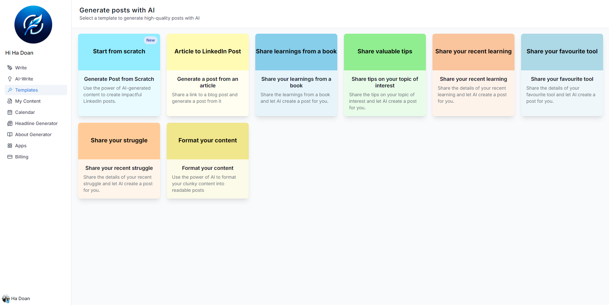
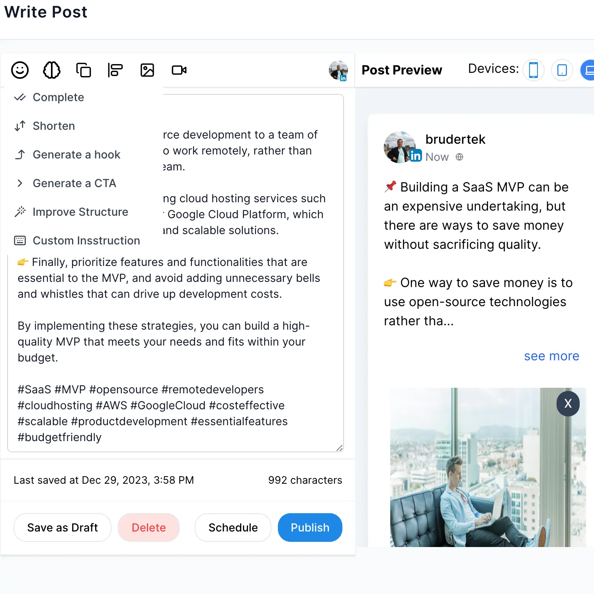

# QuillSocial

> **AI-powered social media management.**

[Website](https://www.quillai.social) | [GitHub](https://github.com/hadoan/QuillSocial) | [Docs](https://docs.quillai.social)

---

**QuillSocial** helps you generate content, schedule posts, and track performance — all in one platform, powered by AI.



### ✨ Features
- AI-driven post & caption generation
- Smart scheduling across platforms (LinkedIn, Instagram, X, and more)
- Analytics dashboard to monitor performance
- Multi-account and team collaboration
- Open-source and easily extendable




---

### 🛠️ Tech Stack
- Next.js + TailwindCSS
- OpenAI GPT Integration
- Docker & Google Cloud Run

---

### 🚀 Getting Started

Clone and run locally:

```bash
git clone https://github.com/hadoan/QuillSocial.git
cd QuillSocial
docker-compose up --build
```

---

### 📄 License
[MIT License](LICENSE)

---

**Give us a ⭐ if you like the project!**

